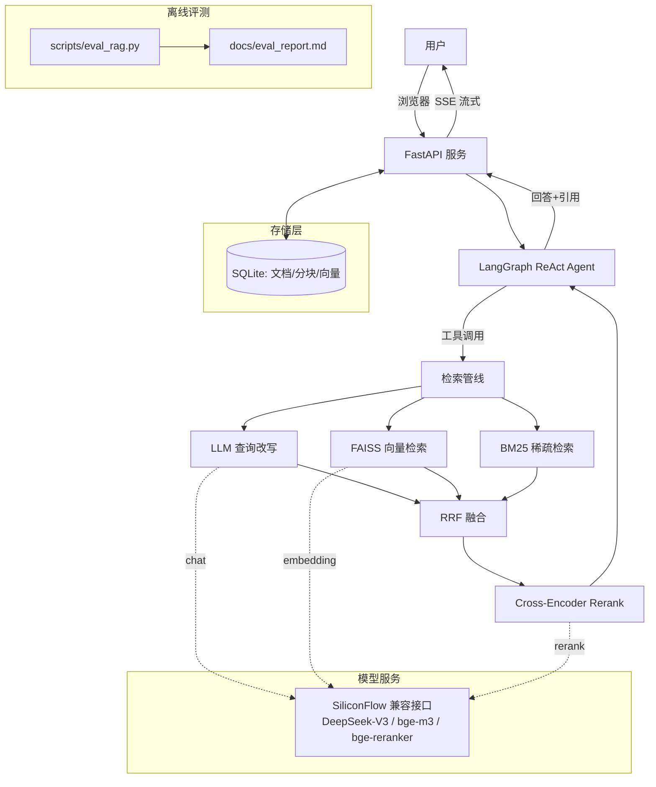

# 🧠 企业知识库 AI 助手（Agentic RAG）

> 基于「向量检索 + BM25 + RRF 融合 + Cross-Encoder 重排序 + LangGraph ReAct Agent」的企业级知识库问答系统。
> 支持 PDF/TXT/MD 文档上传、持久化存储、多轮会话、流式问答，并自带**离线检索评测体系与量化指标**。

    

---

## ✨ 核心特性

| 能力 | 说明 |
| --- | --- |
| 🚀 **Agentic RAG** | LangGraph ReAct 代理：知识库检索 / 数学计算 / 转人工 多工具自主决策 |
| 🔍 **混合检索** | 稠密向量（FAISS 余弦）+ 稀疏检索（BM25 中文分词）双路召回 |
| 🧬 **RRF 融合** | Reciprocal Rank Fusion 无参融合多路结果，避免分数尺度不一致问题 |
| ✏️ **查询改写** | LLM 将问题改写为多角度查询（RAG-Fusion），提升长尾/口语化问答召回 |
| 🎯 **重排序** | bge-reranker-v2-m3 Cross-Encoder 精排 Top-20 → Top-5 |
| 💾 **持久化** | 文档/分块/向量落 SQLite，**服务重启自动恢复，不丢数据** |
| ⚡ **流式输出** | SSE 逐字流式问答，前端打字机体验 |
| 📊 **评测体系** | 自带 14 题评测集，五种检索策略对比，产出 Hit@k / MRR 真实指标 |
| 🧪 **工程化** | 模块化分层、配置中心（无硬编码密钥）、30 项单元测试、健康检查 |
| 🐳 **一键部署** | Docker / docker-compose 生产化部署，含健康检查与数据卷 |

## 🏗️ 系统架构



## 🛠️ 技术栈

| 层次 | 技术 |
| --- | --- |
| 后端框架 | FastAPI + Uvicorn + Pydantic v2 + SSE |
| Agent 编排 | LangGraph（ReAct）+ LangChain 工具调用 |
| 搜索 | FAISS（IndexFlatIP）+ rank-bm25（jieba 中文分词）|
| 模型 | DeepSeek-V3（对话/改写）/ BGE-M3（向量）/ BGE-Reranker-v2-M3（精排），硅基流动兼容接口 |
| 存储 | SQLite（WAL，持久化） |
| 工程质量 | pytest（30 用例）、配置中心 dotenv、健康检查、Docker |

## 🚀 快速开始

### 1. 环境准备

```bash
git clone <your-repo> && cd document_qa
python -m venv .venv && source .venv/bin/activate   # Windows: .venv\Scripts\activate
pip install -r requirements.txt
```

### 2. 配置 API Key

复制 `.env.example` 为 `.env` 并填入密钥（项目启动时会校验，缺失则 fail-fast 并提示）：

```dotenv
# .env
SILICONFLOW_API_KEY=sk-xxxx
SILICONFLOW_BASE_URL=https://api.siliconflow.cn/v1
CHAT_MODEL=deepseek-ai/DeepSeek-V3
EMBEDDING_MODEL=BAAI/bge-m3
RERANK_MODEL=BAAI/bge-reranker-v2-m3
CHUNK_STRATEGY=recursive
CHUNK_SIZE=300
CHUNK_OVERLAP=50
TOP_K=5
```

### 3. 启动

```bash
python "企业知识库 AI 助手 - 综合毕业项目.py"
# 浏览器打开 http://127.0.0.1:8000
```

### 4. Docker 部署

```bash
docker compose up -d --build
# http://127.0.0.1:8000  （data/ 目录挂载为数据卷，重启不丢）
```

## 📊 检索评测结果

> 评测集：`eval/dataset.json`（24 题，9 篇企业语料 / 6 个领域）；指标为真实 API 运行结果，完整报告见 `docs/eval_report.md`，可一键复现：`python scripts/eval_rag.py`

| 检索策略 | Hit@3 | Hit@5 | MRR@5 | Top-1 | 文档命中@5 | 平均耗时 |
| --- | ---: | ---: | ---: | ---: | ---: | ---: |
| 纯向量检索（FAISS） | 95.8% | 100.0% | 90.6% | 83.3% | 100.0% | 230ms |
| 纯 BM25 | 91.7% | 91.7% | 87.5% | 83.3% | 95.8% | <1ms |
| 混合检索（RRF） | 91.7% | 95.8% | 84.2% | 75.0% | 100.0% | 207ms |
| +查询改写（RAG-Fusion） | **100.0%** | 100.0% | 93.1% | 87.5% | 100.0% | 3.6s |
| 生产全流程（+重排） | **100.0%** | **100.0%** | **97.9%** | **95.8%** | **100.0%** | 3.2s |

**亮点结论**（来自真实评测）：查询改写把 Hit@3 拉满 100%；Cross-Encoder 重排再把 MRR@5 / Top-1 分别提升 4.8 / 8.3 个百分点；相对纯向量基线 **Hit@3 +4.2pp、MRR@5 +7.3pp、Top-1 +12.5pp**。代价是端到端延迟（含改写与重排 API 调用），适合「精度优先」场景——这也是 RAG 工程里经典的「精度-延迟」权衡实例。

## 🧪 测试

```bash
pip install -r requirements-dev.txt
pytest          # 30 passed，全部离线（不依赖网络/密钥）
```

## 📁 项目结构

```
document_qa/
├── 企业知识库 AI 助手 - 综合毕业项目.py   # 入口（引导启动）
├── app/                          # 应用核心包
│   ├── config.py                 # 配置中心（.env 校验，fail-fast）
│   ├── db.py                     # SQLite 持久化层
│   ├── chunking.py               # 分块策略（fixed/recursive）
│   ├── document_processor.py     # 解析→分块→向量化→入库
│   ├── retrieval.py              # 混合检索管线（FAISS+BM25+RRF+Rerank）
│   ├── agent.py                  # LangGraph ReAct Agent
│   ├── llm.py                    # LLM/重排客户端（重试、打桩友好）
│   ├── routes.py / main.py       # 路由与应用组装
│   └── state.py                  # 组合根/运行时状态
├── tests/                        # 30 项单元测试（离线）
├── scripts/eval_rag.py           # 检索评测（多策略对比）
├── eval/                         # 评测语料与评测集
├── docs/eval_report.md           # 评测报告（自动生成）
├── Dockerfile / docker-compose.yml
└── resume_material.md            # 简历素材（可直接引用）
```

## 📡 API 一览

| 方法 | 路径 | 说明 |
| --- | --- | --- |
| POST | `/documents/upload` | 上传文档（pdf/txt/md），自动建索引与 Agent |
| GET | `/documents` | 文档列表 |
| DELETE | `/documents/{name}` | 删除文档（级联清理） |
| POST | `/chat` | 同步问答 |
| POST | `/chat/stream` | SSE 流式问答 |
| GET | `/health` | 健康检查（含脱敏配置与索引状态） |
| GET | `/` | Web 前端 |

## 🗺️ 未来展望

- 语义分块 / 文档结构感知（标题层级加权）；
- 多轮检索上下文压缩与引用溯源（回答逐句标注来源）；
- 知识图谱辅助召回；向量化缓存（query 去重）；
- 评估集扩充与 LLM-as-Judge 端到端答案质量评测；
- 多租户权限隔离与审计日志。

## ⚠️ 注意

- `.env` 包含真实 API Key，**切勿提交到 Git**（已加入 `.gitignore`）；
- 文档数据默认存放在 `data/`（SQLite），部署时请挂载该目录确保持久化。

---

*本项目为毕业设计 / 简历展示项目，由 FastAPI + LangGraph + FAISS 技术栈构建，全部代码与评测数据可复现。*